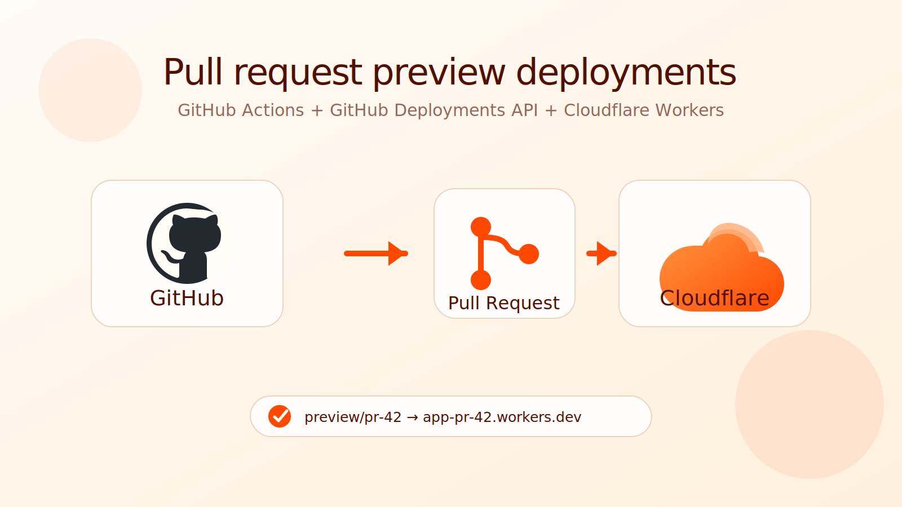

# preview-deployments-skill

An agent skill to add preview deployments to your Cloudflare apps using GitHub Actions workflows and the GitHub Deployments API.



## Install

```bash
npx skills add zeke/preview-deployments-skill --global --yes --al
```

## What It Does

- Adds per-PR Cloudflare Workers preview deployments.
- Publishes preview status through GitHub Deployments, not PR comments.
- Supports shared production resources, empty per-PR resources, or seeded per-PR resources.
- Tears previews down when PRs close or merge.

The source graphic lives in `graphic/` for browser-based export.
